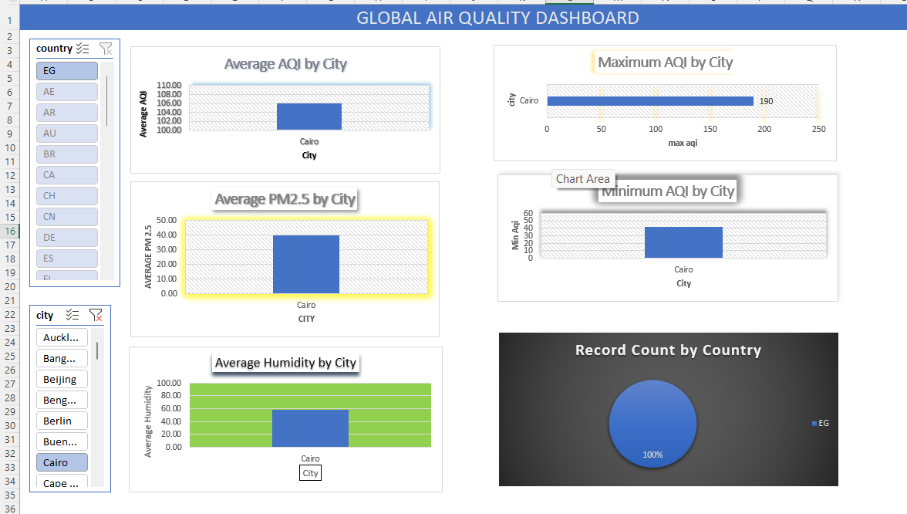

# 📊 Excel Air Quality Dashboard

## 📌 Project Overview

This project focuses on cleaning, analyzing, and visualizing Air Quality data using Microsoft Excel. The dashboard provides interactive insights into AQI levels, pollutant concentrations, and air quality trends.

---

## 🎯 Objective

The objective of this project is to clean raw Air Quality data and build an interactive dashboard in Microsoft Excel to support data-driven analysis.

---

## 🛠 Tools Used

- Microsoft Excel
- Pivot Tables
- Pivot Charts
- Slicers
- Conditional Formatting

---

## 📂 Dataset

Dataset: Air Quality Dataset

---

## 📊 Dashboard Features

- Data Cleaning
- Missing Value Check
- Duplicate Check
- Pivot Tables
- Pivot Charts
- AQI Analysis
- Pollutant Analysis
- Interactive Slicers

---

## 📷 Dashboard Preview



---

## 📁 Repository Structure

```
Excel-Air-Quality-Dashboard
│
├── air quality project using excel.xlsb
├── air quality clean file.csv
├── Excel_Dashboard_Screenshot.png
└── README.md
```

---

## 💡 Key Insights

- Cleaned raw Air Quality data.
- Created Pivot Tables for analysis.
- Built interactive Excel dashboard.
- Analyzed AQI and pollutant levels.

---

## 🚀 Skills Demonstrated

- Data Cleaning
- Excel Dashboard Development
- Pivot Tables
- Pivot Charts
- Data Visualization
- Data Analysis

---

## 👨‍💻 Author

**Tanuj Chandila**

Aspiring Data Analyst

### Skills

- SQL
- Power BI
- Excel
- Python
- Pandas
- NumPy
